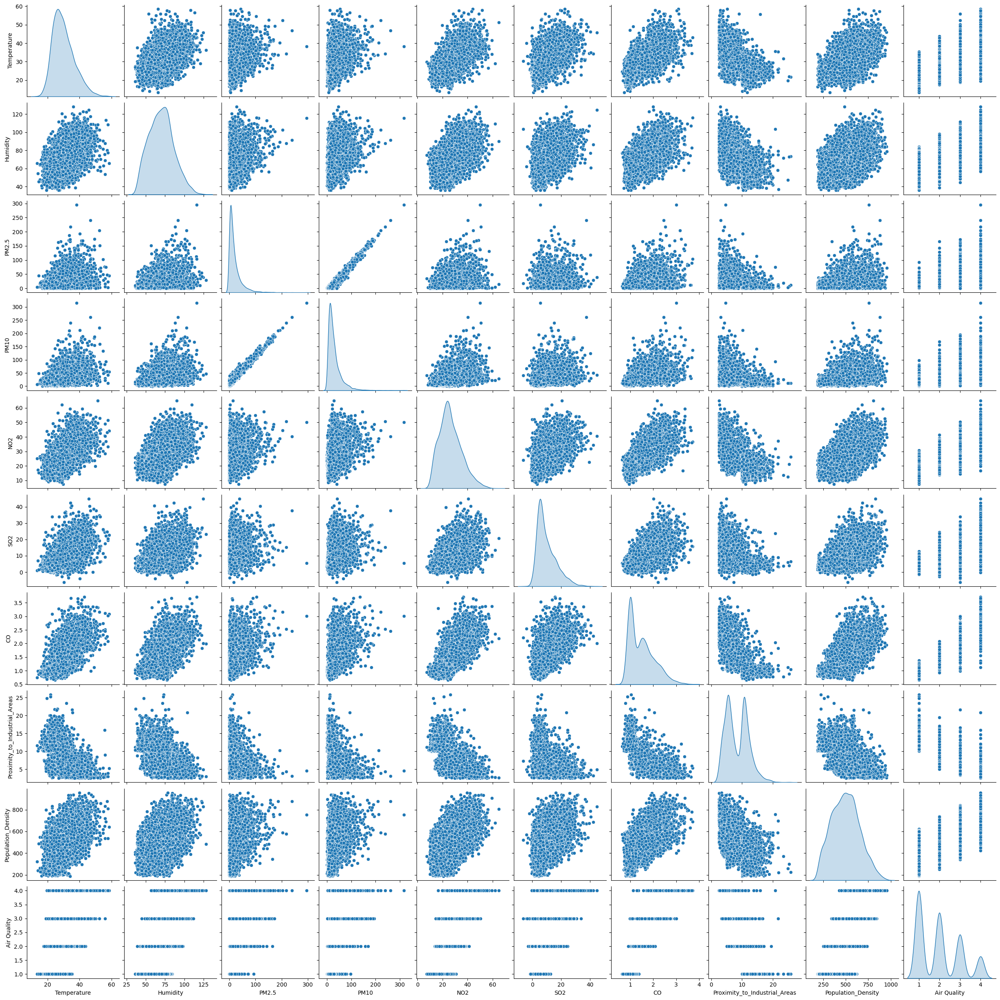
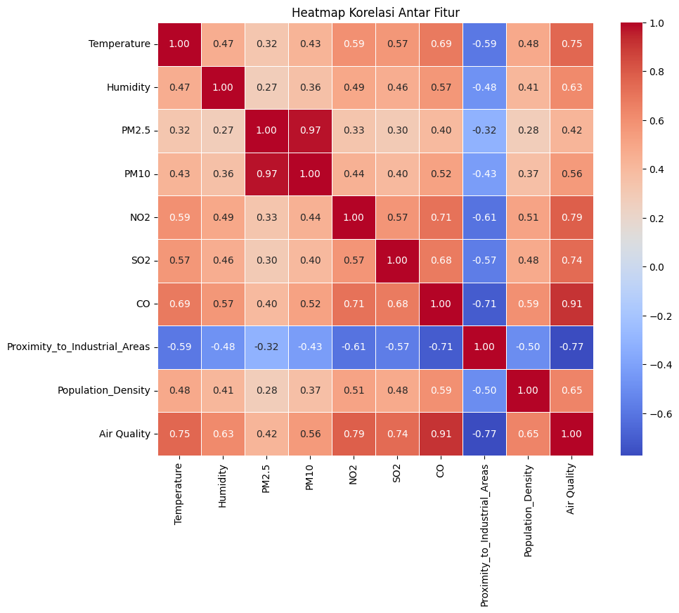

# Laporan Proyek Machine Learning - Muhammad Yasir

## Domain Proyek

Kualitas udara yang buruk telah menjadi salah satu isu lingkungan paling mendesak di banyak kota besar di seluruh dunia, termasuk di Indonesia. Polusi udara memiliki dampak signifikan terhadap kesehatan manusia, ekosistem, dan perubahan iklim. Dataset "Air Quality and Pollution Assessment" dari Kaggle menyediakan data yang berharga mengenai berbagai parameter polusi udara, seperti konsentrasi PM2.5, PM10, NO2, SO2, CO, serta faktor lingkungan lainnya seperti suhu, kelembaban, dan kepadatan penduduk. Dengan menganalisis data ini, kita dapat mengembangkan model prediktif yang dapat memproyeksikan kualitas udara berdasarkan faktor-faktor tersebut, yang berguna untuk perencanaan kota dan kebijakan lingkungan.
Untuk membuat model prediktif kualitas udara, beberapa algoritma machine learning yang akan diterapkan untuk kemudian dilihat algoritma mana yang memiliki performa terbaik terhadap data. Algoritma Logistic Regression digunakan sebagai baseline karena kesederhanaannya dan kemampuannya dalam menangani masalah klasifikasi multi-kelas. Selanjutnya, algoritma Random Forest dan Gradient Boosting diterapkan untuk meningkatkan akurasi prediksi dengan memanfaatkan pendekatan ensemble yang menangkap interaksi kompleks antar fitur. Selain itu, Support Vector Machine (SVM) diterapkan untuk menemukan hyperplane optimal yang memisahkan kategori kualitas udara yang berbeda. Evaluasi menunjukkan bahwa model ensemble, khususnya Random Forest dan Gradient Boosting, memberikan performa terbaik dalam memprediksi kualitas udara, menjadikannya pilihan utama untuk implementasi lebih lanjut.

## Business Understanding

### Problem Statements

1. Kualitas udara yang buruk telah menjadi ancaman kesehatan yang serius di seluruh dunia termasuk Indonesia. Bagaimana ancaman ini dapat diatasi?
2. Bagaimana cara menentukan faktor-faktor yang mempengaruhi kualitas udara guna dapat digunakan dalam model yang akan dibangun?

### Goals

1. Mengembangkan model prediktif yang akurat untuk memproyeksikan kualitas udara berdasarkan berbagai parameter lingkungan dan polusi.
2. Menganalisis faktor-faktor utama yang berkontribusi terhadap kualitas udara dan memahami pola-pola polusi udara.

### Solution Statement

1. Penggunaan berbagai algoritma untuk memprediksi kualitas udara
   Melatih model dengan menggunakan berbagai algoritma guna mencari algoritma mana yang memiliki peforma terbaik untuk diimplemntasikan dengan melihat laporan klasifikasinya berupa recall, precision, dan f1-score. Algoritma yang akan digunakan adalah Logistic Regression, Support Vector Machine, Random Forest, Gradient Boosting, dan K-Nearest Neighbours.
2. Pengoptimalan model dengan hyperparameter
   Setelah semua model dilatih, maka akan dipilih algoritma dengan peforma terbaik guna dilakukan pengoptimalan hyperparameter untuk peningkatan akurasi.

## Data Understanding

Dataset ini berfokus pada kualitas penilaian kualitas udara di berbagai wilayah. Dataset ini berisi 50000 sampel dan menangkap faktor lingkungan dan demografis kritis yang memengaruhi tingkat polusi.
Informasi lebih lanjut dapat dilihat di [Air Quality and Pollution Assessment](https://www.kaggle.com/datasets/mujtabamatin/air-quality-and-pollution-assessment).

### Fitur-fitur Utama:

1. Suhu (°C): Rata-rata suhu wilayah.
2. Kelembaban (%): Kelembaban relatif yang direkam di wilayah tersebut.
3. Konsentrasi PM2.5 (µg/m³): Tingkat partikel halus.
4. Konsentrasi PM10 (µg/m³): Tingkat partikel kasar.
5. Konsentrasi NO2 (ppb): Tingkat nitrogen dioksida.
6. Konsentrasi SO2 (ppb): Tingkat sulfur dioksida.
7. Konsentrasi CO (ppm): Tingkat karbon monoksida.
8. Jarak dari Area Industri (km): Jarak terdekat ke zona industri.
9. Kepadatan Penduduk (orang/km²): Jumlah orang per kilometer persegi di wilayah tersebut.

### Variabel Target: Tingkat Kualitas Udara

1. Baik: Udara bersih dengan tingkat polusi rendah.
2. Sedang: Kualitas udara yang dapat diterima tetapi dengan beberapa polutan.
3. Buruk: Polusi yang terlihat dan mungkin menyebabkan masalah kesehatan bagi kelompok sensitif.
4. Berbahaya: Udara yang sangat terkontaminasi yang menimbulkan risiko kesehatan serius bagi populasi.

### Eksplorasi Data Analysis (EDA)

- Ringkasan deskriptif:
  
  Tabel 1. Deskripsi Statistik
- Korelasi antar fitur menggunakan paiplot
  
  Gambar 1. Diagram pairplot
- Korelasi antar fitur menggunakan heatmap
  
  Gambar 2. Diagram Heatmap
  Berdasarkan diagram heatmap pada Gambar 2, semua fitur memiliki korelasi positif dengan variabel target (air quality) kecuali variabel proximity to indrustial area
