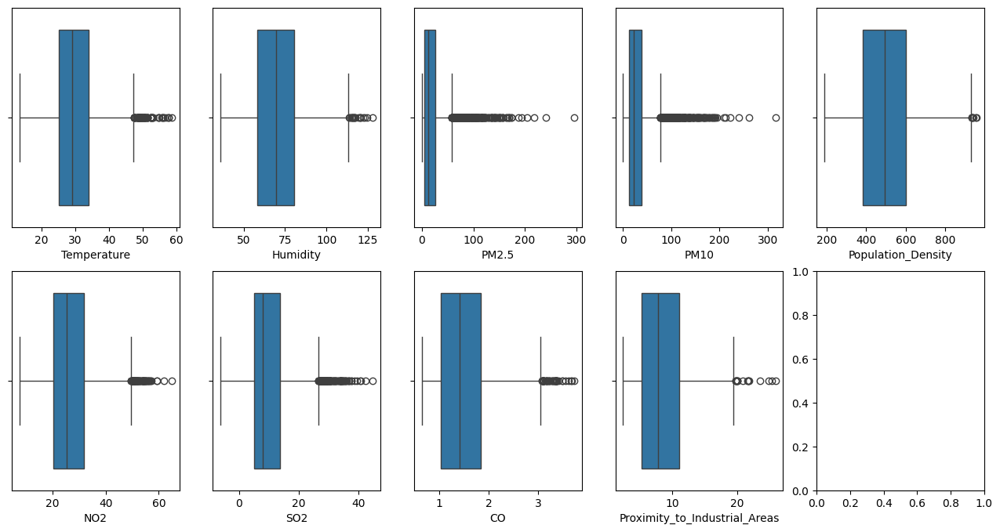

# Laporan Proyek Machine Learning - Muhammad Yasir

## Domain Proyek

Kualitas udara yang buruk telah menjadi salah satu isu lingkungan paling mendesak di banyak kota besar di seluruh dunia, termasuk di Indonesia. Polusi udara memiliki dampak signifikan terhadap kesehatan manusia, ekosistem, dan perubahan iklim. Dataset "Air Quality and Pollution Assessment" dari Kaggle menyediakan data yang berharga mengenai berbagai parameter polusi udara, seperti konsentrasi PM2.5, PM10, NO2, SO2, CO, serta faktor lingkungan lainnya seperti suhu, kelembaban, dan kepadatan penduduk. Dengan menganalisis data ini, kita dapat mengembangkan model prediktif yang dapat memproyeksikan kualitas udara berdasarkan faktor-faktor tersebut, yang berguna untuk perencanaan kota dan kebijakan lingkungan.
Untuk membuat model prediktif kualitas udara, beberapa algoritma machine learning yang akan diterapkan untuk kemudian dilihat algoritma mana yang memiliki performa terbaik terhadap data. Algoritma Logistic Regression digunakan sebagai baseline karena kesederhanaannya dan kemampuannya dalam menangani masalah klasifikasi multi-kelas. Selanjutnya, algoritma Random Forest dan Gradient Boosting diterapkan untuk meningkatkan akurasi prediksi dengan memanfaatkan pendekatan ensemble yang menangkap interaksi kompleks antar fitur. Selain itu, Support Vector Machine (SVM) diterapkan untuk menemukan hyperplane optimal yang memisahkan kategori kualitas udara yang berbeda. Evaluasi menunjukkan bahwa model ensemble, khususnya Random Forest dan Gradient Boosting, memberikan performa terbaik dalam memprediksi kualitas udara, menjadikannya pilihan utama untuk implementasi lebih lanjut.

## Business Understanding

### Problem Statements

1. Kualitas udara yang buruk telah menjadi ancaman kesehatan yang serius di seluruh dunia termasuk Indonesia. Bagaimana ancaman ini dapat diatasi?
2. Bagaimana cara menentukan faktor-faktor yang mempengaruhi kualitas udara guna dapat digunakan dalam model yang akan dibangun?

### Goals

1. Mengembangkan model prediktif yang akurat untuk memproyeksikan kualitas udara berdasarkan berbagai parameter lingkungan dan polusi.
2. Menganalisis faktor-faktor utama yang berkontribusi terhadap kualitas udara dan memahami pola-pola polusi udara.

### Solution Statement

1. Penggunaan berbagai algoritma untuk memprediksi kualitas udara
   Melatih model dengan menggunakan berbagai algoritma guna mencari algoritma mana yang memiliki peforma terbaik untuk diimplemntasikan dengan melihat laporan klasifikasinya berupa recall, precision, dan f1-score. Algoritma yang akan digunakan adalah Logistic Regression, Support Vector Machine, Random Forest, Gradient Boosting, dan K-Nearest Neighbours.
2. Pengoptimalan model dengan hyperparameter
   Setelah semua model dilatih, maka akan dipilih algoritma dengan peforma terbaik guna dilakukan pengoptimalan hyperparameter untuk peningkatan akurasi.

## Data Understanding

Dataset ini berfokus pada kualitas penilaian kualitas udara di berbagai wilayah. Dataset ini berisi 50000 sampel dan menangkap faktor lingkungan dan demografis kritis yang memengaruhi tingkat polusi.
Informasi lebih lanjut dapat dilihat di [Air Quality and Pollution Assessment](https://www.kaggle.com/datasets/mujtabamatin/air-quality-and-pollution-assessment).

### Fitur-fitur Utama:

1. Suhu (°C): Rata-rata suhu wilayah.
2. Kelembaban (%): Kelembaban relatif yang direkam di wilayah tersebut.
3. Konsentrasi PM2.5 (µg/m³): Tingkat partikel halus.
4. Konsentrasi PM10 (µg/m³): Tingkat partikel kasar.
5. Konsentrasi NO2 (ppb): Tingkat nitrogen dioksida.
6. Konsentrasi SO2 (ppb): Tingkat sulfur dioksida.
7. Konsentrasi CO (ppm): Tingkat karbon monoksida.
8. Jarak dari Area Industri (km): Jarak terdekat ke zona industri.
9. Kepadatan Penduduk (orang/km²): Jumlah orang per kilometer persegi di wilayah tersebut.

### Variabel Target: Tingkat Kualitas Udara

1. Baik: Udara bersih dengan tingkat polusi rendah.
2. Sedang: Kualitas udara yang dapat diterima tetapi dengan beberapa polutan.
3. Buruk: Polusi yang terlihat dan mungkin menyebabkan masalah kesehatan bagi kelompok sensitif.
4. Berbahaya: Udara yang sangat terkontaminasi yang menimbulkan risiko kesehatan serius bagi populasi.

### Eksplorasi Data Analysis (EDA)

- Ringkasan deskriptif:
  
  Tabel 1. Deskripsi Statistik
- Korelasi antar fitur menggunakan paiplot
  
  Gambar 1. Diagram pairplot
- Korelasi antar fitur menggunakan heatmap
  
  Gambar 2. Diagram Heatmap
  Berdasarkan diagram heatmap pada Gambar 2, semua fitur memiliki korelasi positif dengan variabel target (air quality) kecuali variabel proximity to indrustial area
- Outliers
  
  Gambar 3. Diagram Boxplot

## Data Preparation

### Seleksi Fitur

Karena semua fitur memiliki korelasi yang tinggi atau setidaknya sedang, maka semua fitur akan digunakan untuk pelatihan. Fitur-fitur tersebut adalah suhu, kelembaban, konsentrasi PM2.5, konsentrasi PM10, konsentrasi NO2, konsentrasi SO2, konsentrasi CO, jarak dan kepadatan penduduk.

### Menangani Outliers

Berdasarkan diagram boxplot sebelumnya dapat dilihat bahwa dataset memiliki outliers. Outliers sendiri adalah sampel yang nilainya sangat jauh dari cakupan umum data utama. Ia adalah hasil pengamatan yang kemunculannya sangat jarang dan berbeda dari data hasil pengamatan lainnya. Pada proyek kali ini, akan digunakan teknik IQR method untuk mengatasi outliers. IQR adalah singkatan dari Inter Quartile Range. Setelah dilakukan pembersihan outliers, jumlah data pada dataset berkurang menjadi 4407.

### Pembagian dataset

Dataset akan dibagi menjadi data latih dan data uji. Data latih digunakan untuk melatih model, sedangkan data uji digunakan untuk menguji kinerja model pada data yang belum pernah dilihat sebelumnya. Dalam proyek ini, data latih akan memiliki ukuran 80% dari dataset dan untuk data latih sebesar 20% dari dataset. Data akan dibagi menggunakan fungsi train_test_split dari library scikit-learn. Jumlah total dataset adalah 5000 data, sehingga data latih akan berjumlah 3525 dan data uji berjumlah 882.

### Standarisasi

Standarisasi adalah teknik praproses data dalam machine learning yang mengubah fitur-fitur dalam dataset sehingga memiliki distribusi dengan rata-rata 0 dan standar deviasi 1. Ini dilakukan untuk memastikan bahwa setiap fitur memiliki skala yang sama. Proses standarisasi membantu meningkatkan konvergensi algoritma machine learning dan performa model dengan mengurangi bias yang disebabkan oleh skala fitur yang berbeda.

# Modelling

Pada tahap ini akan dibangun lima model AI yang menggunakan algoritma yang berbeda-beda untuk kemudian ditentukan model mana yang memiliki performa terbaik terhadap data. Algoritma-algoritma tersebut adalah Logistic Regression, Support Vector Machine, Random Forest, Gradient Boosting, dan K-Nearest Neighbours. Semua algoritma akan dilatih menggunakan parameter default dari library scikit-learn. Kemudian performa akan diukur dari precision, recall, f1-score dan accuracy menggunakan fungsi classification_report dari library scikit-learn.

1. Logistic Regression: Logistic Regression merupakan model dasar yang dapat digunakan untuk klasifikasi multi-kelas. Walaupun sederhana, algoritma ini seringkali memberikan hasil yang cukup baik sebagai baseline. Berikut hasil pelatihan:
   
2. Random Forest: Random Forest adalah algoritma ensemble yang kuat, yang menggabungkan banyak pohon keputusan untuk meningkatkan akurasi prediksi dan mengurangi overfitting. Berikut hasil pelatihan:
   
3. Gradient Boosting: Gradient Boosting adalah teknik ensemble yang menggunakan pendekatan boosting untuk meningkatkan performa model dengan membangun serangkaian model yang memperbaiki kesalahan model sebelumnya. Berikut hasil pelatihan:
   
4. Support Vector Machine: SVM adalah algoritma klasifikasi yang menemukan hyperplane optimal untuk memisahkan kelas-kelas yang berbeda. Ini bisa efektif untuk dataset dengan kelas yang terdefinisi jelas. Berikut hasil pelatihan:
   
5. K-Nearest Neighbors: KNN adalah algoritma sederhana yang mengklasifikasikan data berdasarkan kedekatan dengan contoh pelatihan dalam ruang fitur. Berikut hasil pelatihan:
   

### Evaluasi Model

Tabel 2. Akurasi dari Setiap Model

Berdasarkan tabel di atas dapat dilihat bahwa model yang dibangun menggunakan algoritma Random Forest memiliki peforma terbaik. Langkah selanjutnya kita akan melakukan pengoptimalan hyperparameter dengan metode Grid Search. Grid search adalah metode pencarian hyperparameter yang sistematis dan ekstensif yang digunakan dalam pelatihan model machine learning. Tujuan utama grid search adalah untuk menemukan kombinasi optimal dari hyperparameter yang dapat meningkatkan performa model secara signifikan. Hyperparameter adalah parameter yang tidak dipelajari dari data, melainkan ditentukan sebelum proses pelatihan.

### Tahapan Grid Search:

1. Definisikan Ruang Hyperparameter: Tentukan range atau set nilai hyperparameter yang ingin diuji.
   Berikut cakupan parameter untuk algoritma random forest : - n_estimators: [200, 400, 600], - criterion: ['gini', 'entropy', 'log_loss'], - max_depth: [10, 20, 30, None], - bootstrap: [True, False], - min_sample_leaf: [1, 2, 4], - min_sample_split: [2, 5, 10]

2. Eksplorasi Semua Kombinasi: Grid search akan mencoba setiap kombinasi dari nilai hyperparameter yang telah ditentukan. Untuk algoritma random forest memiliki 1296 kombinasi.

3. Pilih Kombinasi Terbaik: Kombinasi hyperparameter yang menghasilkan performa terbaik pada validasi silang dipilih sebagai kombinasi optimal. Model final kemudian dibangun menggunakan hyperparameter tersebut. Berikut parameter terbaik untuk algoritma random forest: {'bootstrap': False, 'criterion': 'gini', 'max_depth': 20, 'min_samples_leaf': 2, 'min_samples_split': 5, 'n_estimators': 600}

Berikut hasil optimisasi dari algoritma random forest. Terdapat peningkatan peforma tapi tidak terlalu besar.

